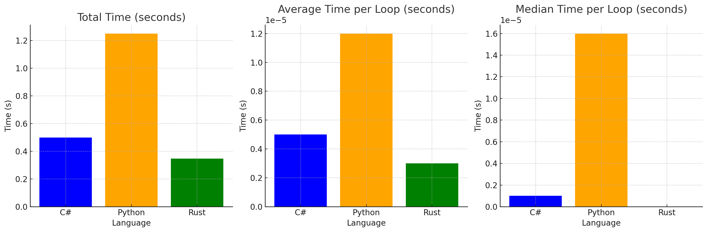

# lang-perf

## Steps for conducting the test

### Dotnet

- Build
    `dotnet build ./dotnet/HelloWorld -c relase `
- Run test 
    `for i in {1..1}; do time ./dotnet/HelloWorld/bin/relase/net8.0/HelloWorld; done `

### Rust
- Build
    `cd ./rust/ && cargo build --release && cd ..`
- Run test 
    `for i in {1..1}; do time ./rust/target/release/hello_world; done `

### Python
- Run test 
    `for i in {1..1}; do time python ./python/main.py; done `

## Results

